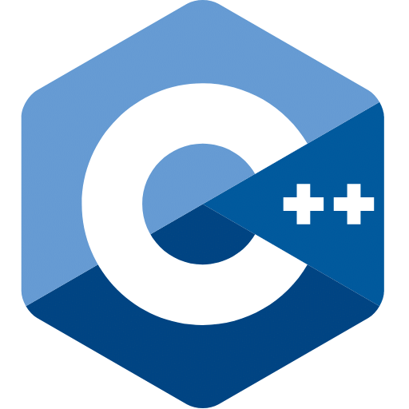

### Hi! I am Hoang Nguyen!

## I am a C++ Software Engineer with special interest in Unmanned Systems, Autonomy, & C++

### Tools I use daily

  
  
  
  
  

### Tools I am familiar with

  
  
  
  
  
  

<!-- These don't have consistent official Simple Icons, so use text or a local image -->

  <b>Also:</b> SFML • Google Test

## Current Projects
- Parallelized the A* pathfinding algorithm using C++ multithreading and CUDA, visualizing it with SFML
- Member, Autonomy Team — SJSU Robotics
- Major Map: An All-In-One, Predictive Tool for Course and Degree Planning

