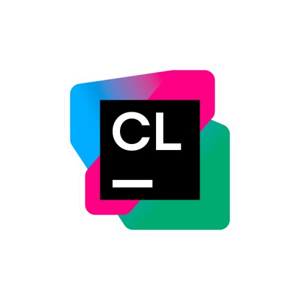
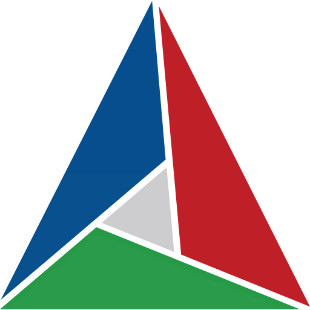

### Hi! I am Hoang Nguyen!

## I am a C++ Software Engineer with special interest in C++ Systems & Autonomy
<i>Former gameplay/AI game dev, which sparked my current interests and goals :D</i>

### Tools I use daily

  
  
  
  
  

### Tools I am familiar/learning

  
  
  
  
  
  

### Other interests
- Rust, Python, Java, Qt, CUDA, OpenCV, Groot2, RTOS, ROS2
- Systems Programming, Embedded, Robotics, Cybersecurity, AI/ML, Simulation

### Current Projects
- Parallelized the A* pathfinding algorithm using C++ multithreading and CUDA, visualizing it with SFML
- Member, Autonomy Team — SJSU Robotics
- Major Map: An All-In-One, Predictive Tool for Course and Degree Planning

